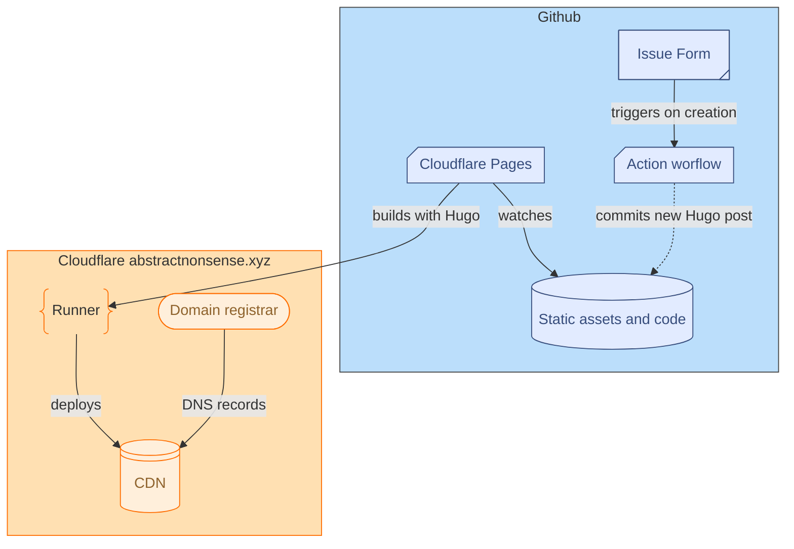

# abstractnonsense

GitHub source code for [abstractnonsense.xyz](https://abstractnonsense.xyz).

### Architecture diagram

```mermaid
---
config:
  look: classic
  theme: default
---
flowchart TD
  subgraph github["Github"]
    source["Static assets and code"]
    cfPages["Cloudflare Pages"]
    actions["Action worflow"]
    issue["Issue Form"]

    issue -- triggers on creation --> actions
    actions -. commits new Hugo post .-> source
    cfPages -- watches --> source
  end
  subgraph cloudflare["Cloudflare abstractnonsense.xyz"]
    domain(["Domain registrar"])
    builder["Runner"]
    cdn["CDN"]

    domain -- DNS records --> cdn
    builder -- deploys --> cdn
  end

  cfPages -- builds with Hugo --> builder
  source@{ shape: db}
  cfPages@{ shape: card}
  actions@{ shape: card}
  issue@{ shape: tag-proc}
  cdn@{ shape: disk}
  builder@{ shape: braces}
   source:::Sky
   cfPages:::Sky
   actions:::Sky
   issue:::Sky
   cdn:::Peach
   domain:::Peach

  classDef Peach stroke-width:1px, stroke-dasharray:none, stroke:#FBB35A, fill:#FFEFDB, color:#8F632D
  classDef Sky stroke-width:1px, stroke-dasharray:none, stroke:#374D7C, fill:#E2EBFF, color:#374D7C
  style cdn stroke:#FF6D00
  style domain stroke:#FF6D00
  style builder stroke:#FF6D00
  style github fill:#BBDEFB,stroke:#424242
  style cloudflare fill:#FFE0B2,stroke:#FF6D00
```
