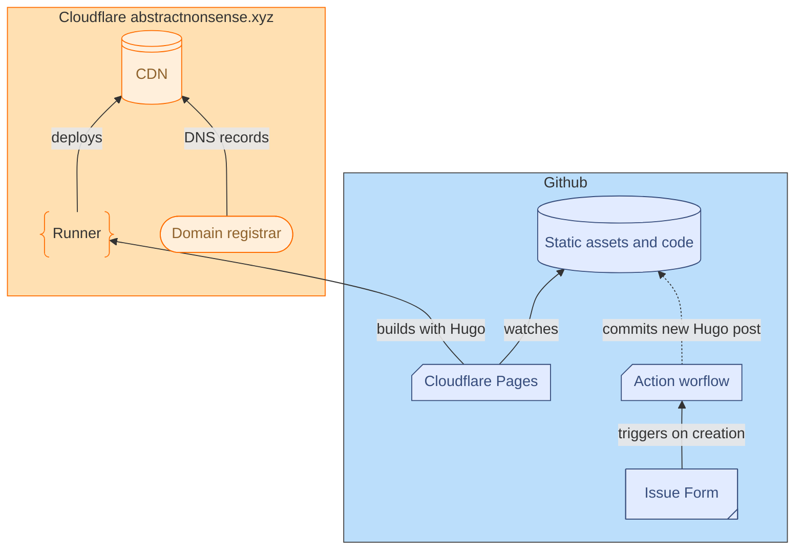

## About Me

This blog is written by Yossi Frenkel. You can contact me at:

1. [<svg xmlns="http://www.w3.org/2000/svg" class="icon" aria-hidden="true" focusable="false" viewBox="0 0 512 512" style="width: 1em; height: 1em; vertical-align: middle; margin-right: 0.5em;"><path d="M416 32H31.9C14.3 32 0 46.5 0 64.3v383.4C0 465.5 14.3 480 31.9 480H416c17.6 0 32-14.5 32-32.3V64.3c0-17.8-14.4-32.3-32-32.3zM135.4 416H69V202.2h66.5V416zm-33.2-243c-21.3 0-38.5-17.3-38.5-38.5S80.9 96 102.2 96c21.2 0 38.5 17.3 38.5 38.5 0 21.3-17.2 38.5-38.5 38.5zm282.1 243h-66.4V312c0-24.8-.5-56.7-34.5-56.7-34.6 0-39.9 27-39.9 54.9V416h-66.4V202.2h63.7v29.2h.9c8.9-16.8 30.6-34.5 62.9-34.5 67.2 0 79.7 44.3 79.7 101.9V416z"/></svg> LinkedIn](https://www.linkedin.com/in/y-frenkel "LinkedIn")
2. [<svg xmlns="http://www.w3.org/2000/svg" class="icon" aria-hidden="true" focusable="false" viewBox="0 0 512 512" style="width: 1em; height: 1em; vertical-align: middle; margin-right: 0.5em;"><path d="M48 64C21.5 64 0 85.5 0 112c0 15.1 7.1 29.3 19.2 38.4L236.8 313.6c11.4 8.5 27 8.5 38.4 0L492.8 150.4c12.1-9.1 19.2-23.3 19.2-38.4c0-26.5-21.5-48-48-48L48 64zM0 176L0 384c0 35.3 28.7 64 64 64l384 0c35.3 0 64-28.7 64-64l0-208L294.4 339.2c-22.8 17.1-54 17.1-76.8 0L0 176z"/></svg>  <code>hello@abstractnonsense.xyz</code>](mailto:hello@abstractnonsense.xyz?subject=Hi&body=Hello,)

<!--!Font Awesome Free 6.6.0 by @fontawesome - https://fontawesome.com License - https://fontawesome.com/license/free Copyright 2024 Fonticons, Inc.-->

## About this site

The site is built and deployed using Cloudflare Pages, GitHub, and Hugo. The source code is available at <https://github.com/stochastical/abstractnonsense/> and follows the following architecture:

